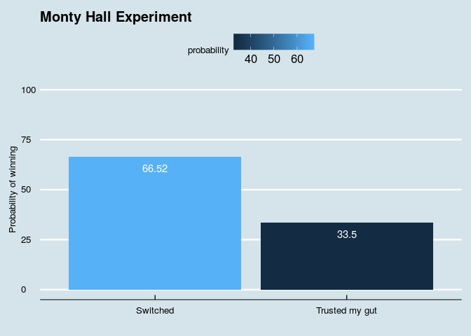
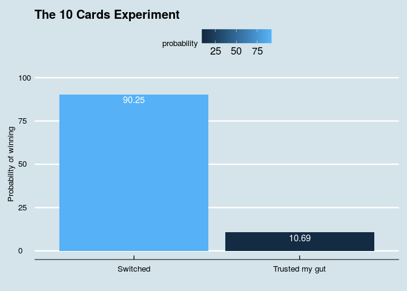
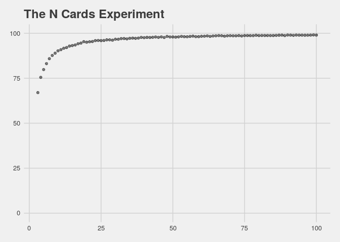

### Do you trust your gut? A probabilistic approach.

I was having some conversations about the Monty Hall experiment and got
quite surprised on how many people even after the explanation, still
think that they would have more chances of winning by sticking with the
first choice. I started to think on ways that I could better show that
this wasn't the fact indeed. Elaborating on this let me to this analysis
that I present to you today.

First of all, let me give you an introducton about what this problem is
all about, Monty Hall was a game show host, in this problem at hand we
analyse the part "Let's make a deal" where contestants were asked to
pick one out of three doors. Behind one of the doors, it was a prize,
and behind the others a goat. The game worked in this way, it was asked
to the contestant which of the doors did they choose. After the fact, it
was showed that behind one of the doors there was a goat. Now we have
only two doors, the one that had been picked, and the other that wasn't
open. In this part of the game he ask the question. Do you want to
change doors? Based on that, is in the best interest of the contestant
switch doors?

Let's look at the first facts, in the inicial phase, you have 3 options
and just one prize to catch, so you have 1/3 chances of winning. You can
prove mathematically that if the contestant switches the door after the
fact, he now have 2/3 chances of winning.

### How could we go about proving this

I didn't follow the math path as my intention was giving some intuition
on the problem at hand. The best way I could show that switching is in
fact in the best interest, was to stop with all those peoples that I've
talked and make this experiment. Stand by 3 doors, put a prize behind
one of them, nothing in the others and following the game. I could do
this 20 times, the first 10 times we wouldn't change doors, the next 10
we would. In that way I could show that it's really in the best interest
switching doors. But I bet you're also thinking what I did, there's no
way in hell that a single person would've given me the time and pacience
to make this experiment. Also if we just had made 20 times this game we
wouldn't be so sure of the final results. So what's the other option?
Simulations!

I ran a simulation for 10000 games and those are the results. Just what
it was mathematically expected. If you stick by your door, you have
about 1/3 chance of winning, if you've switched, it was about 2/3.

    ## 
    ## Attaching package: 'dplyr'

    ## The following objects are masked from 'package:stats':
    ## 
    ##     filter, lag

    ## The following objects are masked from 'package:base':
    ## 
    ##     intersect, setdiff, setequal, union

### I Still trust my gut

For the ones that still are not true believers of the wonders of
probability, I'll still try to convice you. I created another experiment
called 10 cards experiment, it's pretty like the door problem. I have 10
cards, numered from 1 up to 10. I'll give you 10 bucks if you can choose
the number 8 card. In the first place, you take a card and don't look at
it, then I'll turn 8 cards up to you, none of these are the 8 card. Now
the game is on, do you, or don't you switch your card? In the first
choice you had 1/10 chances of winning, if you switch in the last move,
you'll have 9/10 chances of winning! And here's the simulation

### Exaggerating the problem

Now let's suppose I couldn't convice you so far, and suppose you are
still reading up to this point. Let's go crazy and exaggerate the
problem. Now I have a deck of 20 cards, or 30 cards, 50? And what about
70? 100? I created a simulation from 3 cards up to 100 and here are the
results, About 50 cards you pretty much win every time if you switches
your card and lose if you don't! Crazy? No, just probability. Hope
you've liked it

### For the curious enogh

Here's the related code [Do you trust your
gut?](https://github.com/silvajhonatan/do-you-trust-your-gut)
